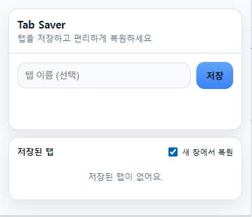

# Tab Saver

현재 열려 있는 모든 탭을 한 번에 저장하고,  
필요할 때 다시 열 수 있는 **심플한 Chrome 확장 프로그램**입니다.

---

## 📸 스크린샷

---

## ✨ 주요 기능

- 현재 창의 모든 탭 한 번에 저장
- 저장한 탭 한 번에 복원
- 새 창에서 복원 옵션 지원
- 드래그 & 드롭으로 저장된 탭 순서 변경
- 도메인별 탭 선택 복원
- 로컬 저장 (계정 / 클라우드 없음)
- `chrome://`, `about:blank` 등 내부 탭 자동 제외
- 다국어 지원 (한국어, 영어, 일본어, 중국어)

---

## 🧭 사용 방법

### 탭 저장
1. Chrome 툴바에서 **Tab Saver** 아이콘 클릭
2. (선택) 탭 묶음 이름 입력
3. **[저장]** 버튼 클릭
4. → `탭 N개 저장됨` 메시지 확인

### 탭 복원
- **현재 창에서 복원**
    - *새 창에서 복원* 체크 해제
    - 저장된 탭에서 **[열기]** 클릭

- **새 창에서 복원**
    - ☑️ *새 창에서 복원* 체크
    - 저장된 탭에서 **[열기]** 클릭

- **도메인별 복원**
    - 저장된 탭 펼치기
    - 원하는 도메인 클릭

---

## 🛠 설치 방법 (개발자 모드)

1. `chrome://extensions` 접속
2. 개발자 모드 활성화
3. **압축 해제된 확장 프로그램 로드**
4. 프로젝트 폴더 선택

---

## 🔒 개인정보 보호

Tab Saver는 사용자의 개인 정보를  
**수집, 저장, 전송하지 않습니다.**

모든 데이터는 사용자의 브라우저에만  
**로컬로 저장**됩니다.

---

## 📄 License

MIT
